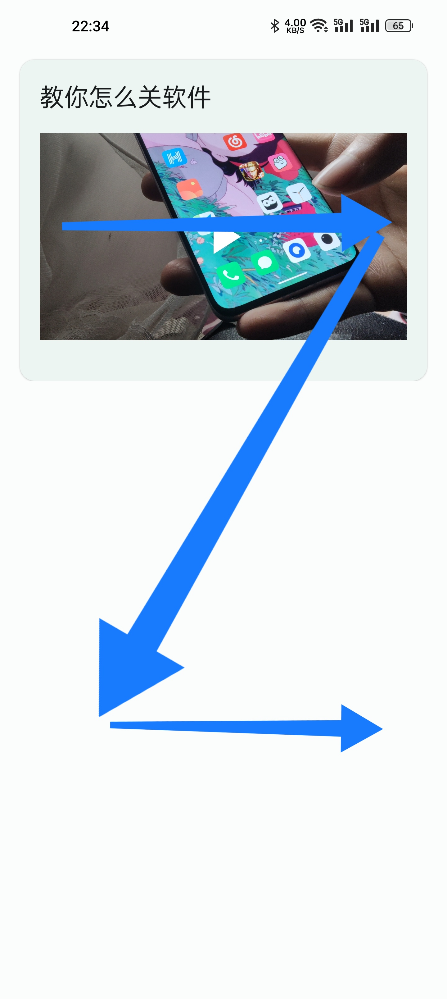
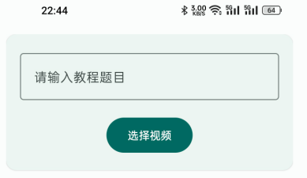
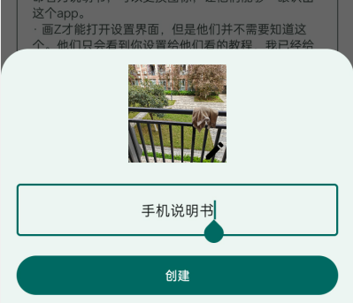
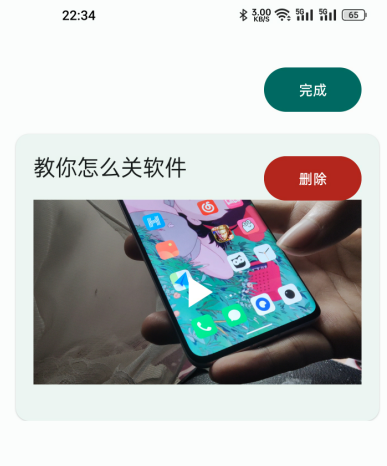

# 给他们的说明书
尝试为解决中老年人不敢用，不会用手机的现象的一个解决方案。

我父母在使用智能手机的时候经常会问我哪个功能怎么用，尤其是抖音拍视频和微信的一些功能。在身边的时候还好，我能够手把手教学，但是没有在身边的时候就很麻烦了，他们根本听不懂，不敢操作，因为中老年人总有一种想法，一不小心就会扣钱，不敢乱操作，这都是历史遗留问题，虽然现在的支付手段很安全，但是他们仍然不敢。为此我还让我父母和我用同一个品牌的手机，这样我能够通过远程控制来帮他，但这不是长久之计。所以我制作了此款应用。

- 极简UI，避免页面元素对中老年人的干扰
- 随意“更改图标”，有利于找到本APP

​                                **“下载apk体验”文件夹内有安装包**

**技术栈：**Kotlin + MVVM + DataStore + Flow + Media3 + 协程

**设计语言：**Material Design 3 + Dynamic Color

### 使用指南：

1. 当主页面没有数据的时候，显示跳转到设置按钮，当主页面有数据的时候，主页面画Z进入设置界面

2. 顶部可添加视频和视频标题

3. 可“更改”图标  （实际为创建了一个新图标，可自定义图标和图标名称，当创建完成之后请手动隐藏本app原始图标，比如放入文件夹）

4. 修改视频教程列表

